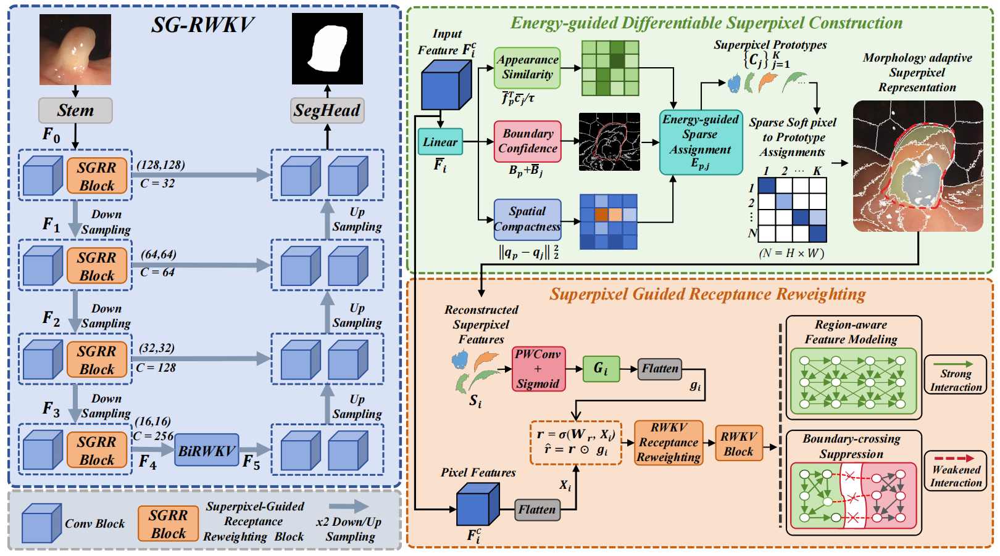
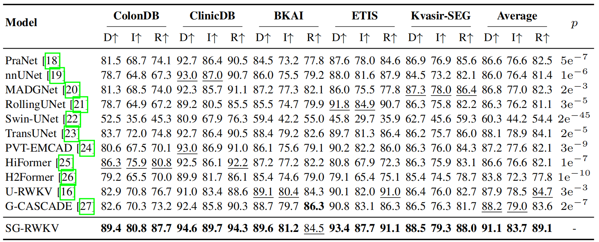
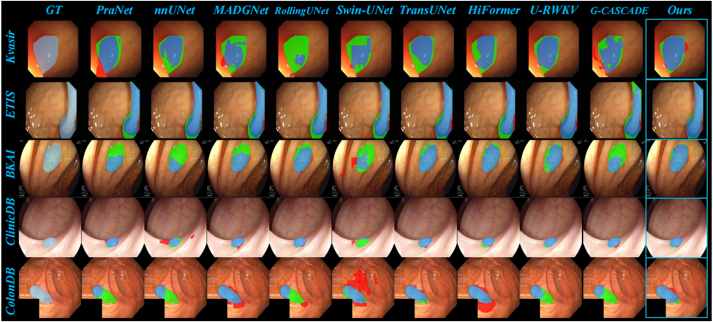
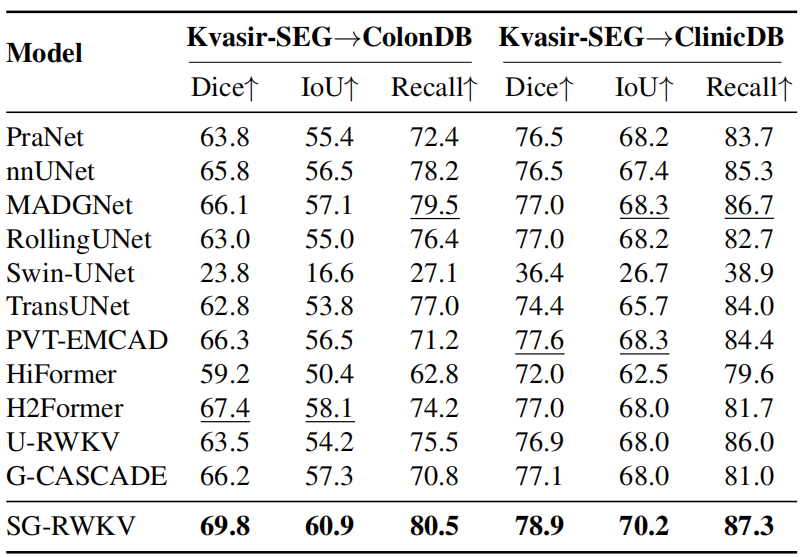
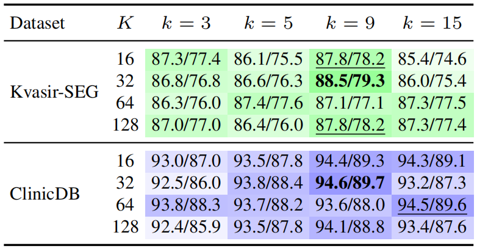
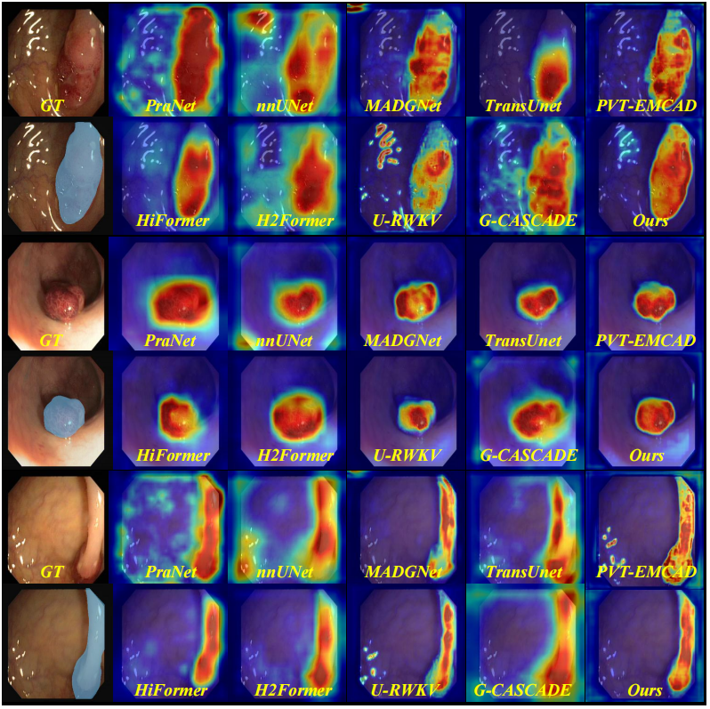
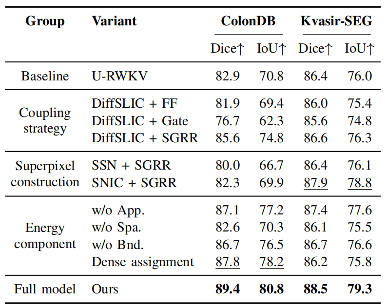

# SG-RWKV: Superpixel-Guided RWKV for Polyp Segmentation

> **Paper Title:** SG-RWKV: Superpixel-Guided RWKV for Polyp Segmentation  
> **Venue:** BIBM 2026 Anonymous Submission  
> **Status:** Under anonymous review

<div>
  <a href="https://www.python.org/"></a>
  <a href="https://pytorch.org/"></a>
  <a href="https://lightning.ai/"></a>
  
  
</div>

## News

- **2026-07-06:** Anonymous GitHub package prepared for review.
- **2026:** Paper submitted to BIBM 2026.

## Overview

This repository provides the anonymous PyTorch implementation of **SG-RWKV**, a superpixel-guided RWKV network for colorectal polyp segmentation.

Polyp segmentation is challenging because lesions often have irregular shapes, ambiguous boundaries, specular highlights, and mucosa-like textures. Existing grid- or patch-based representations may fragment coherent lesion regions or mix lesion and background tissues. Meanwhile, RWKV- and Mamba-style models provide efficient long-range modeling, but their feature propagation is usually governed by predefined scan patterns and may be insensitive to image-specific region boundaries.

SG-RWKV addresses this representation-to-modeling gap with two modules:

- **Energy-guided Differentiable Superpixel Construction (EDSC):** builds morphology-adaptive superpixel representations by jointly modeling appearance similarity, boundary confidence, and spatial compactness.
- **Superpixel-Guided Receptance Reweighting (SGRR):** uses reconstructed superpixel features to reweight the RWKV receptance gate, strengthening feature interaction inside coherent polyp regions while suppressing unreliable cross-boundary propagation.

## Framework

<div align="center">
  
  <br>
  <em>Overall architecture of SG-RWKV. EDSC generates morphology-adaptive superpixel representations, and SGRR injects the structural prior into the RWKV receptance pathway.</em>
</div>

## Main Results

### Quantitative Comparison

<div align="center">
  
</div>

SG-RWKV is evaluated on five public polyp segmentation datasets: **CVC-ColonDB**, **CVC-ClinicDB**, **BKAI**, **ETIS**, and **Kvasir-SEG**. It achieves the best average Dice, IoU, and Recall among the compared methods.

| Method | Average Dice | Average IoU | Average Recall |
| :-- | --: | --: | --: |
| Second-best competing result | 88.2 | 79.0 | 84.7 |
| **SG-RWKV** | **91.1** | **83.7** | **89.1** |

### Qualitative Results

<div align="center">
  
  <br>
  <em>Qualitative comparison on representative polyp images. SG-RWKV produces more complete masks and fewer boundary errors.</em>
</div>

### Cross-Dataset Generalization

<div align="center">
  
</div>

| Train -> Test | Dice | IoU | Recall |
| :-- | --: | --: | --: |
| Kvasir-SEG -> ColonDB | **69.8** | **60.9** | **80.5** |
| Kvasir-SEG -> ClinicDB | **78.9** | **70.2** | **87.3** |

These results indicate that superpixel-guided RWKV modeling improves robustness under source-to-target domain shifts.

### Parameter Sensitivity

<div align="center">
  
</div>

The sensitivity analysis studies the number of superpixel prototypes `K` and the sparse assignment size `k`. A moderate setting (`K=32`, `k=9`) provides a strong balance between structural adaptiveness and region consistency.

### Feature Visualization

<div align="center">
  
  <br>
  <em>Feature activation maps show that SG-RWKV produces more localized and structure-consistent responses around polyp regions.</em>
</div>

### Ablation Study

<div align="center">
  
</div>

The ablation study validates three design choices: receptance-level superpixel coupling, energy-guided superpixel construction, and the necessity of the appearance, spatial compactness, boundary confidence, and top-k sparse assignment components.

## Code

The anonymized implementation is provided under [`code/`](code/).

```text
code/
  configs/
    hs3r_kvasir_example.yaml
  src/
    data/
    lightning/
    metrics/
    models/
    utils/
  tools/
    train_hs3r.py
    evaluate_hs3r.py
  checkpoints/
  requirements.txt
```

Core files:

- `code/src/models/HS3R_Net_V005.py`: final SG-RWKV model wrapper.
- `code/src/models/HS3R_Net_SGRC_Base.py`: U-shaped encoder-decoder, bidirectional RWKV bottleneck, and SGRR blocks.
- `code/src/models/HS3R_Net_Block.py`: EDSC and superpixel construction modules.
- `code/src/models/HS3R_Net_SPV005_EnergyVariants.py`: energy ablation variants.
- `code/src/models/wkv_op.cpp` and `code/src/models/wkv_cuda.cu`: CUDA WKV backend.

## Dataset Preparation

The released code contains one dataset example configuration for a Kvasir-SEG-style dataset. Please arrange the data under `code/data/`:

```text
code/
  data/
    Kvasir-SEG/
      images/
        sample_001.png
        sample_002.png
      masks/
        sample_001.png
        sample_002.png
```

Image and mask files are paired by filename stem. For example, `images/001.png` is paired with `masks/001.png`.

The paper evaluates on five public datasets:

| Dataset | Task | Samples |
| :-- | :-- | --: |
| CVC-ColonDB | Polyp segmentation | 380 |
| CVC-ClinicDB | Polyp segmentation | 612 |
| BKAI | Polyp segmentation | 1200 |
| ETIS | Polyp segmentation | 196 |
| Kvasir-SEG | Polyp segmentation | 1000 |

For anonymous review, no dataset files are redistributed in this repository. Please download the public datasets from their official sources.

## Environment Setup

```bash
cd code

conda create -n sg-rwkv python=3.10 -y
conda activate sg-rwkv

pip install -r requirements.txt
```

The CUDA WKV extension is compiled on first use from `src/models/wkv_op.cpp` and `src/models/wkv_cuda.cu`. For a quick CPU smoke test, add `--cpu` to the training or evaluation command.

## Quick Start

### Training

```bash
cd code

python tools/train_hs3r.py \
  --config configs/hs3r_kvasir_example.yaml \
  --dataset Kvasir-SEG \
  --devices 1
```

### Evaluation

Place a checkpoint under `code/checkpoints/`, then run:

```bash
cd code

python tools/evaluate_hs3r.py \
  --config configs/hs3r_kvasir_example.yaml \
  --checkpoint checkpoints/sg_rwkv_kvasir.ckpt \
  --dataset Kvasir-SEG \
  --devices 1
```

## Reproducibility Settings

The main paper settings are:

- Input size: `256 x 256`.
- Dataset split: `8:1:1` train/validation/test split.
- Random seed: `3407`.
- Batch size: `8`.
- Optimizer: AdamW.
- Initial learning rate: `3e-4`.
- Weight decay: `1e-4`.
- Scheduler: cosine annealing.
- Minimum learning rate: `1e-6`.
- Loss: equal-weighted Dice loss and cross-entropy loss.
- Metrics: Dice, IoU, and Recall.

## Checkpoints

Pretrained checkpoints are not included in this anonymous review package. They will be released after the review policy permits. The `code/checkpoints/` directory is provided as a placeholder for local evaluation.

## Citation

Citation information will be updated after the review period. During anonymous review, please cite this work as:

```bibtex
@inproceedings{anonymous2026sgrwkv,
  title={SG-RWKV: Superpixel-Guided RWKV for Polyp Segmentation},
  author={Anonymous},
  booktitle={BIBM},
  year={2026}
}
```

## Acknowledgements

This implementation is built with PyTorch and PyTorch Lightning. It also uses CUDA WKV components for efficient RWKV-style sequence modeling. We thank the open-source community for making these research tools available.
